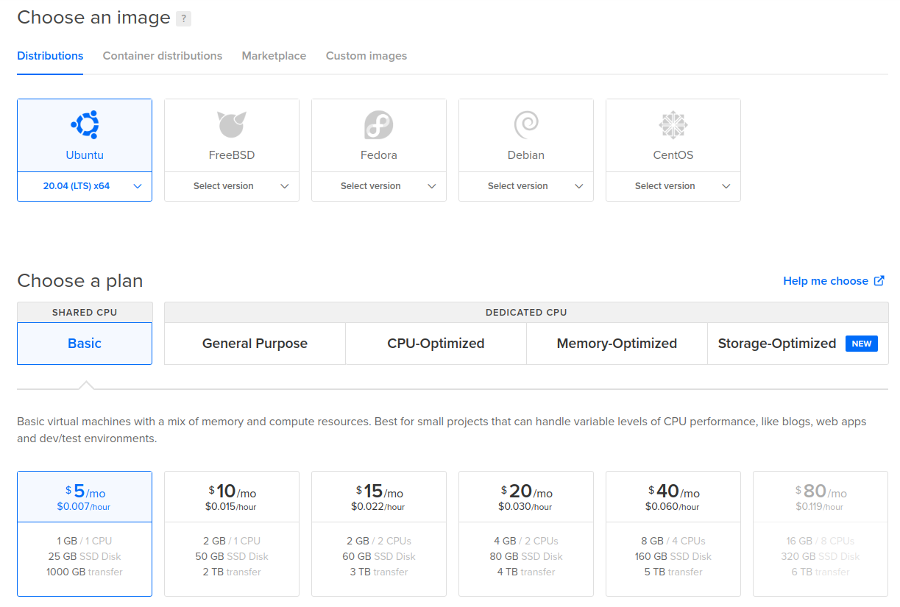
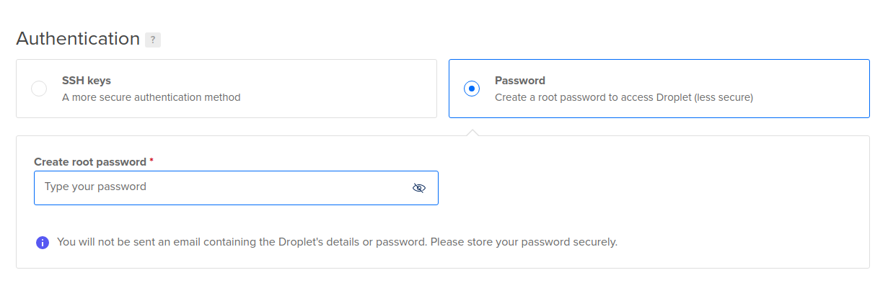
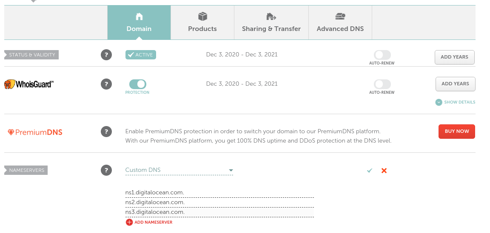
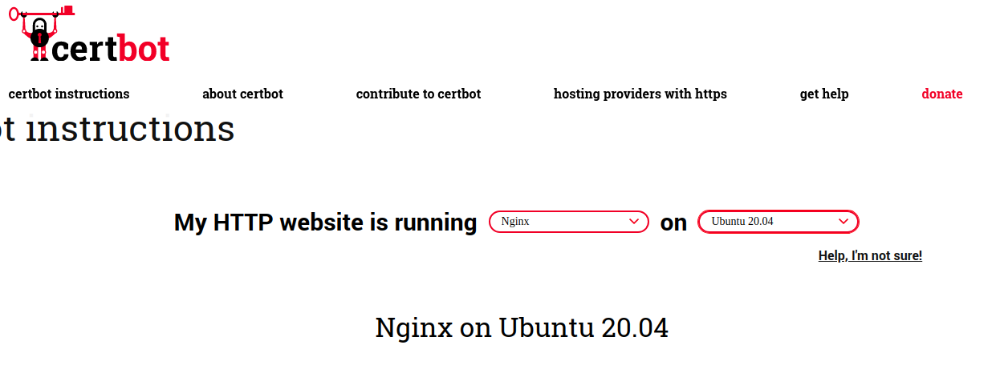
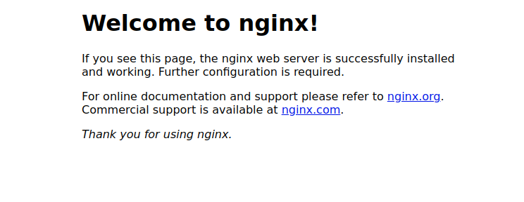

# Deploy fullstack Nodejs MongoDB Express backend and React frontend on Digital Ocean with NGINX single droplet

It took me 2 weeks to figure out how to deploy my fullstack nodejs react app. It uses the MERN stack - mongodb, express, react, and nodejs. I watched multiple youtube videos and read various blogs. I had to reference numerous different sources so here is a consolidated guide of how to do it.

## Digital Ocean Setup <!--(digitalocean referral link) -->

I hosted my server on digitalocean.
The alternatives includes Amazon AWS, Google Cloud, Siteground, Heroku, etc but I found that digitalocean was the easiest, most reliable and the cheapest in the long run.

## Create Droplet on Digital Ocean

Create a Digital Ocean account and then create a droplet. Choose the latest ubuntu image from Distrubutions, choose the plan and monthly rate that fits your needs. For toy apps or hobby projects you can just choose the basic plan and the cheapest monthly rate. You can always upgrade later.

A droplet is a virtual private server (VPS).

I DID NOT select mongodb from the marketplace. For some reason it works better for me if I manually install it on the droplet.

_Choose ubuntu, basic plan, and lowest monthly option_


_You can choose either SSH keys or password. The password option is the fastest. Just create a password and that will be what you'll use to login in when you ssh into the vps ubuntu linux distribution. You can change it to ssh later on_


## Adding a domain to your application.

_if you want to get a SSL certificate from LetsEncrypt you will need a domain name. LetsEncrypt does not give certificates to raw ip address. You may be able to find other certificate providers who will give certificates for raw ips but I don't know which ones_

On digitalocean, on the sidebar go to > Networking
Enter yourdomainname.com and add
Add an A record for @ and www to your droplet.

1. Add @ under HOSTNAME, select your droplet under WILL DIRECT TO and click _Create Record_
2. Add www under HOSTNAME, select your droplet under WILL DIRECT TO and click _Create Record_

Go to domain registrar, (I use Namecheap)<!--(namecheap referral link) -->, add the nameservers to the custom DNS section



This will take anywhere between 15 - 20 minutes to propogate. It may take longer. Check https://www.whatsmydns.net/ to see propgation status of your domain name.

## SSH into droplet and install mongodb, node, nginx and pm2

SSH into the vps ubuntu linux distribution by opening your terminal if your on mac or linux with the ip address generated by digitalocean. This can be found on the droplet next to the name of the droplet

```
ssh root@your-ip-address-from-digitalocean-next-to-droplet
```

Enter y when terminal asks

`Are you sure you want to conitnue connecting (yes/no/[fingerprint])?`

Then it will ask you for your the root password you created in the Authentication section.

Now you're logged in.

I installed mongodb manually and did not install it from the marketplace.

```
sudo apt update
sudo apt upgrade
sudo apt install mongodb
sudo systemctl status mongodb
```

<!-- https://linuxhint.com/install_mongodb_ubuntu_20_04/
https://www.digitalocean.com/community/tutorials/how-to-install-mongodb-on-ubuntu-20-04 -->

Install Node/NPM. Installing node will also install NPM in most cases. if not then also install npm
Here is a link to the [digitalocean node install guide](https://www.digitalocean.com/community/tutorials/how-to-install-node-js-on-ubuntu-20-04) for your reference

```
curl -sL https://deb.nodesource.com/setup_12.x | sudo -E bash -
sudo apt install nodejs
sudo apt install build-essential

#if you do not have npm after installing node
npm install npm@latest -g

#check version
node -v
npm -v

```

### Install NGINX, a opensource web server.

NGINX can be used as a reverse proxy, it connects server to the internet and provides protection between requests.

```
#option 1 for installing nginx
sudo apt install nginx

#option 2 for installing nginx
sudo apt-get install nginx -y
```

### Add SSL with LetsEncrypt

To get commands got to [Certbot website](https://certbot.eff.org) and click on _Get Certbot instructions_. Select the software and system to get the instructions
you need to run on the droplet.



```
sudo snap install core; sudo snap refresh core
sudo snap install --classic certbot
sudo ln -s /snap/bin/certbot /usr/bin/certbot

# recommended option
sudo certbot --nginx
# Y to Terms of Service to register with ACEM server
# Y or N to share eamil with Electronic Frontier Foundation
# domainname.com to No names wer found in your configuration files. Please enter in your domain name(s)

# conservative option, if you want to make changes to nginx configuration by hand
sudo certbot certonly --nginx

# auto renew certificates before they expire
sudo certbot renew --dry-run

```

_Go to your domainname.com and you should see the default nginx page_



### Update NGINX configuration file to direct traffic

```
#update nginx configuration file using nano, vim, or another editor
sudo nano /etc/nginx/sites-available/default
```

_Copy in the following into the file you just opened. update the values for domainname.com to be your own and port to the port you want to run on._

_Copy into first server object and comment out_

- listen 80 default_server;
- listen [::]:80 default_server;

_MAKE SURE to copy into second server object also_

The location /api is for routing calls to the api to the node server
For this example I'm using localhost:5000 (port 5000) for my frontend and localhost:5001 (port 5001) for my backend

```
server {

 root /var/www/html;
 server_name domainname.com;


 location / {

 proxy_pass http://localhost:5000;
 proxy_set_header X-Forwarded-For $proxy_add_x_forwarded_for;
 proxy_set_header Host $host;
 proxy_set_header X-NginX-Proxy true;
 proxy_http_version 1.1;
 proxy_set_header Upgrade $http_upgrade;
 proxy_set_header Connection “upgrade”;
 proxy_max_temp_file_size 0;
 proxy_redirect off;
 proxy_read_timeout 240s;
 }

 location /api {
    proxy_pass http://localhost:5001;
 }
}
```

NGINX works with Ubuntu firewall ufw. type ufw app list to see options:

- Nginx-Full — Enables both ports 22 and 88 for HTTP and HTTPS access, respectively.
- Nginx-HTTP — Enables port 22 for HTTP only.
- Nginx-HTTPS — Enables port 80 & HTTPS only.
- OpenSSH

```
# Enable https ports for nginx on ubuntu firewall
sudo ufw enable
ufw allow 'Nginx HTTPS'
ufw status # checks status of firewall

# Check NGINX config
sudo nginx -t

# Restart NGINX
#option 1 to restart nginx
sudo service nginx restart
#option 2 to restart nginx
sudo systemctl restart nginx

#other nginx commands
sudo systemctl status nginx
sudo systemctl stop nginx

```

### Create a Hello.js Application to Test Nginx configuration

```
cd ~
nano hello.js
```

```
const http = require('http');

const hostname = 'localhost';
const port = 5000;

const server = http.createServer((req, res) => {
  res.statusCode = 200;
  res.setHeader('Content-Type', 'text/plain');
  res.end('Hello World!\n');
});

server.listen(port, hostname, () => {
  console.log(`Server running at http://${hostname}:${port}/`);
});
```

```
node hello.js
```

Go to your domainname.com and you should see

> _Hello World_

### Install PM2 and Serve

- PM2 is a process manager for nodejs applications with built-in load balancer. it keeps the app running in the background

- Serve is for the React frontend app

```
sudo npm install pm2 -g
sudo npm i -g serve

#you can test out pm2 with hello.js
pm2 start hello.js

#you can see the status of pm2 using
pm2 ps

# Other pm2 commands
pm2 show app.js
pm2 status
pm2 restart app.js
pm2 stop app.js
pm2 logs (Show log stream)
pm2 flush (Clear logs)

# To make sure app starts when reboot
pm2 startup ubuntu
```

## Add the frontend React app

Change your apiUrl to a realtive path, preferrably just "/api"
This will make it so that your apiEndpoint will be /api/user for the user route.

```
# An example will be that your React app will request either
axios.post("/api/users", userVariable)

# or it will be the following if you create wrap axios in a httpService
http.post("/api/users", userVariable)
```

Add the a proxy variable under the eslintConfig in package.json so that in the dev environment the apiUrl is still routing correctly

```
  "eslintConfig": {
    "extends": "react-app"
  },
  "proxy": {
    "/api": {
      "target": "http://localhost:3900"
    }
  },
```

Build your react application and move it to your droplet ubuntu linux distribution server

```
npm run build

#check ufw status, if enabled you have to disable temporarily
sudo ufw disable

#option 1 for moving build folder into droplet
sudo rsync -azv build root@droplet-ip-address:/var/www/html/

#if you want to move it into the home folder
sudo rsync -azv build root@droplet-ip-address:~

#option 2 for moving build folder into droplet
sudo scp -r build/ root@droplet-ip-address:/var/www/html/

#after moving the files you can enable again
sudo ufw enable
```

```
# try the follow first to serve frontend to see if it works
serve -s /var/www/html/build/

# pm2 to serve continuously
pm2 start serve -- -s /var/www/html/build/
```

## Set up nodejs backend

Clone your backend from Github and start your app to make sure it's working

```
git clone your-backend-repo-name.git
cd your-backend-repo-name
npm install
```

May need to set up environment variable if you have them.
Create your relevant env, toml, json files for environment variable
In your repo folder create a .env file if you're using dot-env.

```
touch .env
nano .env
# copy-paste in your environment variables.
```

Run the backend to see if it works

```
node index.js # haven't configured a script for running the app
npm start # if you've set up a start script
ctrl-C # to stop app
```

Your application should run. Make sure it is running before moving on to the next step. Go to your https://domainname.com/api. Page should display _Cannot GET /api_

```
#run the backend with pm2 to have it run in the background
sudo pm2 start index.js
```

## Conclusion

```
# To make sure app starts when reboot
pm2 startup ubuntu
```

There are a lot of different ways you can host your fullstack, frontend, backend applications and I choose put frontend and backend on a single droplet on digital ocean. If there is anything confusing or I got something wrong please let me know. Please also let me know if you find this helpful. Feel free to leave your comments.
Thanks!

Sources:

[Youtube: Full Node.js Deployment - NGINX, SSL with Lets Encrypt](https://www.youtube.com/watch?v=oykl1Ih9pMg&ab_channel=TraversyMedia)

[Github Gist: Nodejs deployment PM2, NGINX, LetsEncrypt](https://gist.github.com/bradtraversy/cd90d1ed3c462fe3bddd11bf8953a896)

[Youtube: Plan, Code, Deploy a Startup in 2 Hours ~ deploy instructions @ 1:35:00](https://www.youtube.com/watch?v=lauywdXKEXI&ab_channel=freeCodeCamp.org)

[Hackernoon: Finish deploying react app on digitalocean](https://hackernoon.com/start-to-finish-deploying-a-react-app-on-digitalocean-bcfae9e6d01b)

[Digital Ocean: Set Up nodejs application](https://www.digitalocean.com/community/tutorials/how-to-set-up-a-node-js-application-for-production-on-ubuntu-18-04)

[Digital Ocean: Run nodejs server with Nginx](https://www.digitalocean.com/community/questions/how-to-run-node-js-server-with-nginx)

[Medium: Deploy fullstack with NGINX Digitalocean](https://medium.com/front-end-weekly/deploy-fullstack-with-nginx-on-digital-ocean-ed1fbc92275f)

[Dev.to: Fullstack using React, Strapi, NGINX, MongoDB on Digitalocean](https://dev.to/jackrkelly/create-a-full-stack-web-application-using-react-strapi-nginx-mongodb-and-digitalocean-bkh)

[Configure nginx for nodejs backend and React frontend](https://www.digitalocean.com/community/questions/configure-nginx-for-nodejs-backend-and-react-frontend-app)

[Freecodecamp: deploy first fullstack web app](https://www.freecodecamp.org/news/develop-deploy-first-fullstack-web-app/)
